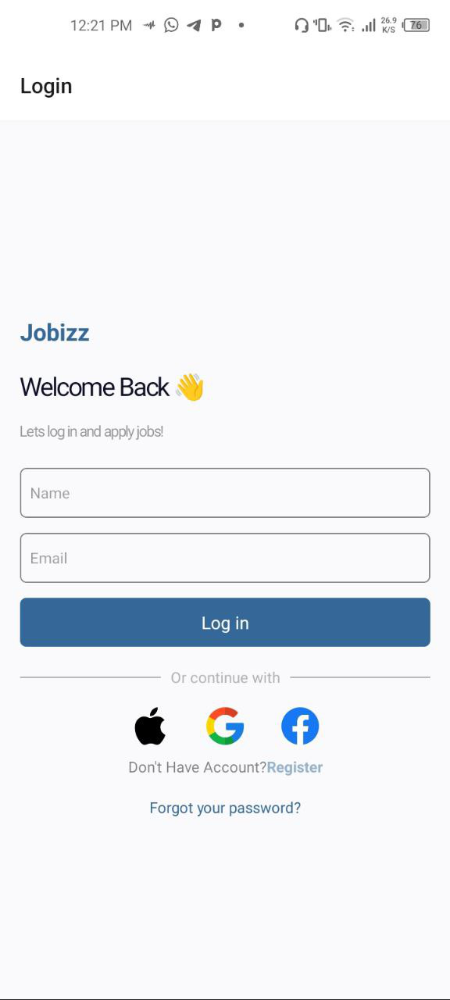
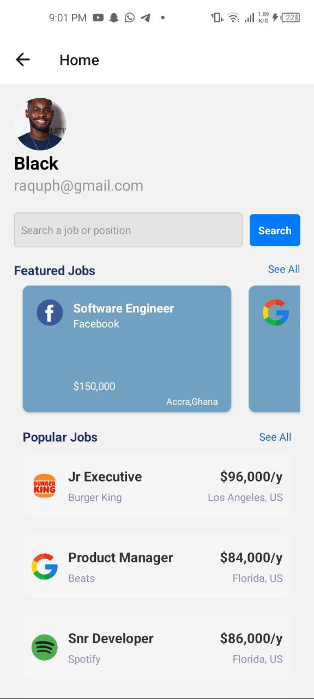

# Job Finder App

## Overview

The Job Finder App is a React Native application designed to help users search for job listings and view popular and featured job opportunities. The app includes features such as job search, viewing job details, and browsing popular and featured job categories.

## Features

- **Search Jobs**: Users can search for jobs by title.
- **Popular Jobs**: Display a list of popular jobs.
- **Featured Jobs**: Highlight and display featured job listings.
- **Responsive Design**: Optimized for both Android and iOS devices.

## Screenshots

### Login Screen

### Home Screen

